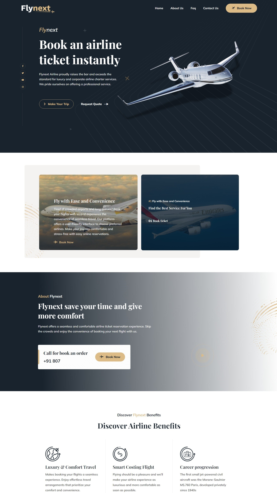
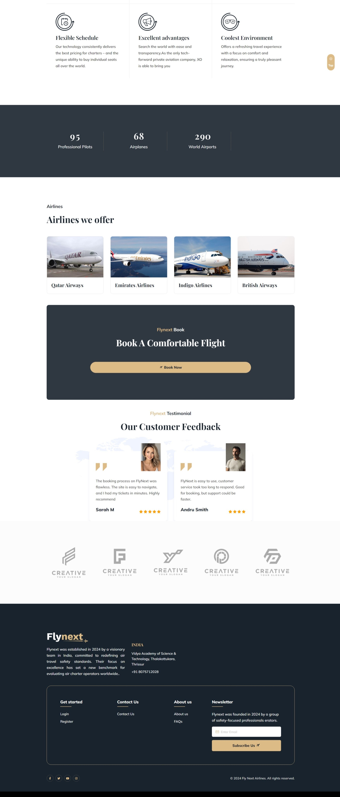
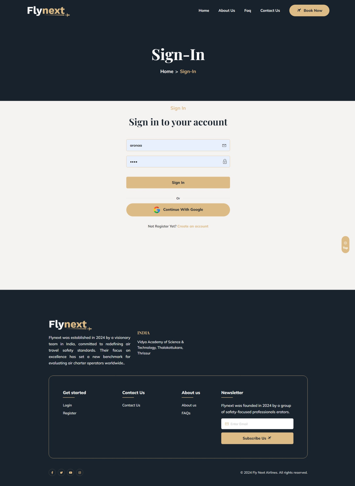
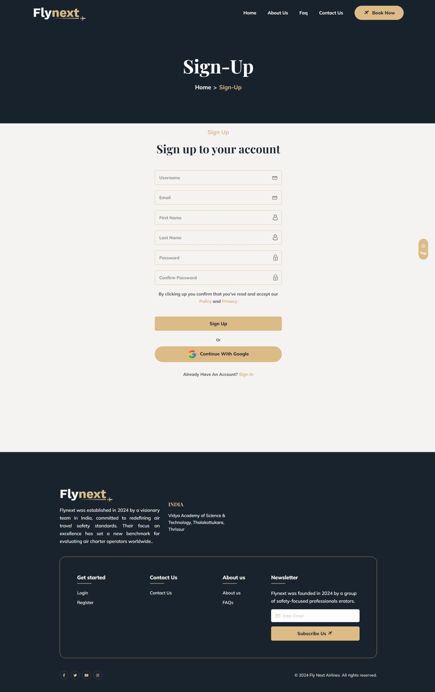
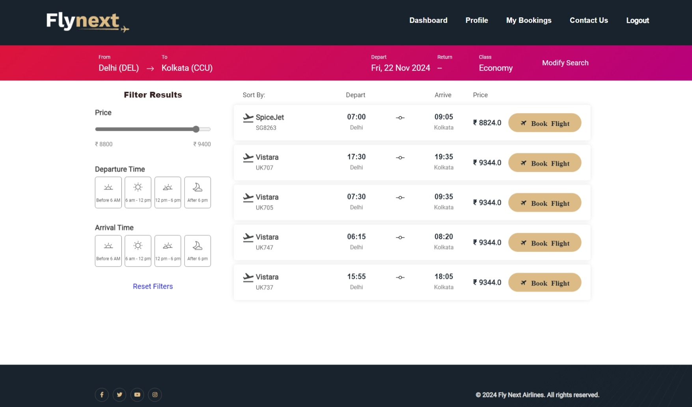
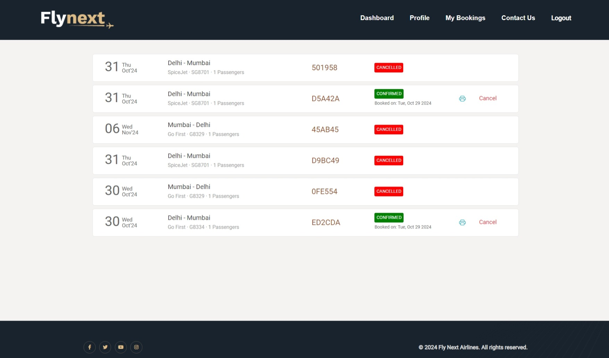
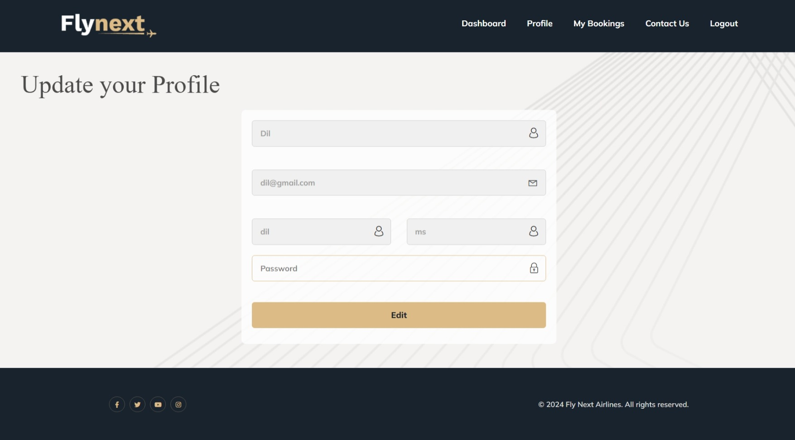

# FLYNEXT ✈️

**FLYNEXT** is a full-featured airline ticket reservation platform built to make flight booking seamless, fast, and intuitive. With user account management, real-time search, secure payments, and ticket handling, FLYNEXT brings the power of modern airline systems to the web.

---

## 🚀 Features

- 🔐 User registration and login system
- 📅 Real-time flight search with booking options
- 🧾 E-ticket generation and print view
- 👤 Profile and booking history dashboard
- ✈️ Class-based flight filtering
- 🛡️ Secure and simple ticket cancellation/resume process
- 🧭 Beautiful landing page and responsive design
- 🖥️ Admin dashboard for flight and user management

---

## 📸 Screenshots

> Key screens from the FLYNEXT user experience:

### 🏠 Homepage
  


### 🔐 Authentication
  


### ✈️ Flight Search & Dashboard
  


### 📋 Bookings & Profile
  


---

## 🛠️ Getting Started

To set up and run the project locally:

```bash
git clone https://github.com/yourusername/FLYNEXT.git
cd FLYNEXT

# Install dependencies and run (if using Django, for example)
pip install -r requirements.txt
python manage.py migrate
python manage.py runserver
